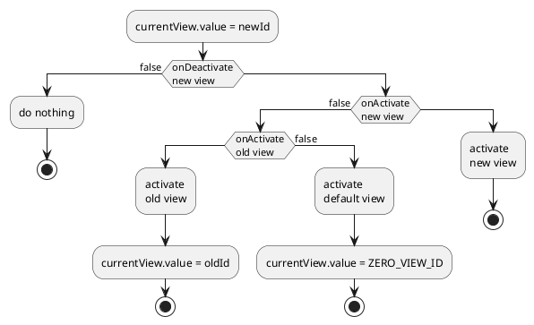

# vue-multi-view

library to handle many vue components like tabs in browser

Compatible with vue-router

Source code: https://github.com/FragsterAt/vue-multi-view

Online demo: https://vmv-demo.fragster.ru/

Demo source code: https://github.com/FragsterAt/vue-multi-view-demo

## Installation
```bash
yarn add vue-multi-view
# or
npm install vue-multi-view
```

## Usage

### Create object with available 'views'

key of object will be the view name, used in openView function

```javascript
const views = {
  counter: {
    meta: { icon: 'calculate' }, // any meta info, default is blank object
    component: () => import('pages/CounterView.vue')
  },
  image: {
    title: 'Image view', // default title of view (if not specified - this is key of view)
    component: () => import('pages/ImageView.vue')
  },
  entity: () => import('pages/EntityView.vue') // if all controlled by view component, you can pass only import
}
```

### Add plugin to vue app

```javascript
import { createApp } from 'vue'
import { createMultiView } from 'vue-multi-view'

import App from './App.vue'

const app = createApp(App)

app.use(createMultiView, {
  componentName: 'MultiView', // Optional, this is default value
  views // Object with views definitions, required!
})

app.mount('#app')
```

### Add component to show content of views

```html
<multi-view>
    <!-- default content, if current view is not specified-->
    <router-view /> <!-- for example it can be router or any other component -->
</multi-view>
```

default slot and all views keeps their state even they is not visible

### Add component to switch between views

You can switch between views by changing currentView.value (it's reactive)

Here is example with [Quasar](https://quasar.dev/) but you can use lib with any vue-based framework or even without framework at all
```html
<template>
  <q-tabs v-model="currentView" align="left" inline-label>
    <q-tab :name="ZERO_VIEW_ID" icon="home" label="Router" /> <!-- to switch to default slot -->
    <q-tab :name="view.viewId" :icon="view.meta.icon" v-for="view in viewList" :key="view.viewId">{{
      view.title }} <q-btn round flat @click.stop="closeView(view.viewId)" icon="delete" dense></q-btn></q-tab>
  </q-tabs>
</template>

<script setup>
import { viewList, currentView, closeView, ZERO_VIEW_ID } from 'vue-multi-view'
</script>
```

### Open view

Simple open view (or activate if it is opened)
```javascript
import { openView, getUniqueKey } from 'vue-multi-view'

const viewId = openView('view1') // check, if view is already opened, if it is - activates it, otherwise - opens it
// return id of activated view
```

Other options:

```javascript
openView(
  'view1',
  { propName: 1 }, // pass props to the view. on reopen - change component props with this values
  'viewKey', // search views not only by name, but also with specified key. after opened, view can change it's key
  {
    parentViewId: viewId, // if specified, opened view will be closed with closing of view with specified id,
    // also searching of already opened views performed only in child views
    inBackground: false // if true, do not activate opened/founded view
  }
)
```

`getUniqueKey()` returns new unique key for open new view every time (this is simple counter)

### Get/set view properties from opened view

Some view properties returned with useMultiView function:
```javascript
import { useMultiView } from 'src/../vue-multi-view'
const {
  viewId, // id of view. may be used to open child views
  parentViewId, // id of parent views. may be used to open sibling views
  uniqueKey // readonly computed unique key of opened view, just for info
  } = useMultiView()
```
`useMultiView()` **must** be called in setup (or onCreate if you use options api), if called in other places it will do nothing

To change view properties you must pass params in `useMultiView`:
```javascript
const uniqueKey = computed(() => props.id ?? entity.value.id)
const title = ref('title')

const useMultiView({ // passed data can be
  title, // reactive
  uniqueKey, // computed
  meta: { // or static
    icon: 'description'
  }
})
```
If you change reactive uniqueKey, when new view is opened - it will search view with new value of key, look at 'entities' section of demo.

You can call useMultiView in child components of view, but it highly recommended not to pass any params in this case. See components/ViewInfo in demo

### Register hooks

There are three hooks: onActivate, onDeactivate and onBeforeClose, that are triggered when view is activated, deactivated or when view is about to closed.

Also, if hook return false - active view will be not changed, closing will be canceled.

```javascript
import { onActivate, onDeactivate } from 'vue-multi-view'

onActivate(async () => {
  console.log('view activated with delay')
})
onDeactivate(async () => {
  console.log('view deactivated with delay')
})

onBeforeClose(async () =>
  !modified.value || await confirmDialog({ message: 'Entity is modified, continue?', cancel: true })
)
```

If activation hook of new view fails and then activation hook of previous view also fails - current view will be switched to zero view:


### Close view

Just call `closeView(viewId)` and it triggers `onBeforeClose` hook. If it return `false` - nothing happened, otherwise view closed, onUnmount and other vue lifecycle hooks triggered.

View can close itself (with id from useMultiView).

Before close view all descendant views tries to close themselves. If they fails - nothing happened, even `onBeforeClose` hook will not called.
